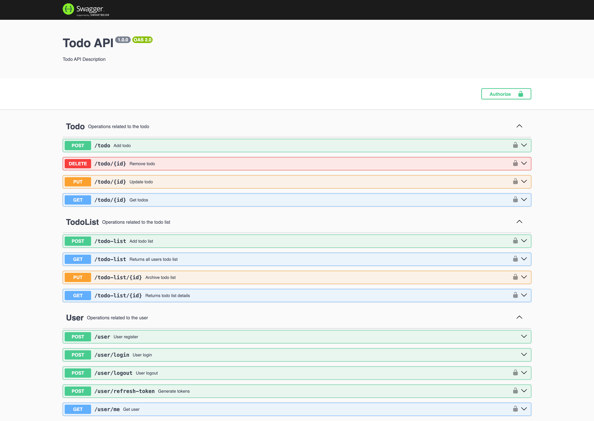

# Todo-Express-App

## To run back end in dev environment

First you have to create a mysql database and have to add necessary credentials to the /config/config.json

`"username": "user",
"password": "secret",
"database": "movie_library",
"host": "mysql_server",
"dialect": "mysql",`

From the Backend directory, you can run:

### `npm install`
### `npm run dbmigrate`
### `npm run dev`

Open [http://localhost:3002](http://localhost:3002) to view it in the browser.

## API Documentation

Swagger URL - [http://localhost:3002/api-docs](http://localhost:3002/api-docs)

## To run test cases in development

First you have to create a mysql test database and change the necessary credentials in config/config.json.

    "username": "root",

    "password": null,

    "database": "todo_app",

    "host": "mysql_server",

    "dialect": "mysql",

    "migrationStorage": "sequelize",

    "migrationStorageTableName": "sequelize_meta",

    "seederStorage": "sequelize",

    "seederStorageTableName": "sequelize_seeders"

#### Run Migrations - `npm run dbmigrate:test`

#### Run Test Cases - `npm run test:coverage`

After running above commands you can generate the coverage report of the backend integration.

### Coverage report sample ([http://localhost:30002/coverage](http://localhost:3002/coverage))

